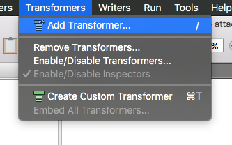
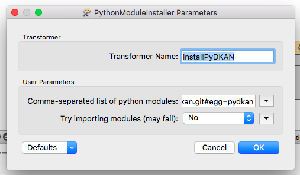

# Setting a fme workflow to use the dkan api python client (pydkan)

## Configure the PythonModuleInstaller transformer

This transformer gives people the possibility to install a third party python library (as pydkan) while running a workflow so it's available within fme workbench's python.

+ Go to **Transformers/Add Transformer** (or type `/`)



+ Type `PythonModuleInstaller`



+ Name the transformer as you like
+ Paste `git+git://github.com/NuCivic/pydkan.git#egg=pydkan` inside the `Comma-separated list of python modules` field
+ Set `Try importing modules` is set to `NO` (optional)
+ Click `ok`


Run the workflow. Check the `translation logs` for something like this:

```
Extracting pydkan-0.1-py2.7.egg to /Users/teofilosibileau/Library/Python/2.7/lib/python/site-packages
pydkan 0.1 is already the active version in easy-install.pth

Installed /Users/teofilosibileau/Library/Python/2.7/lib/python/site-packages/pydkan-0.1-py2.7.egg
```

That means the library will be available from now on. You can either remove the transformer or leave it there to grab future updates (recommended)

