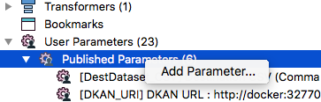
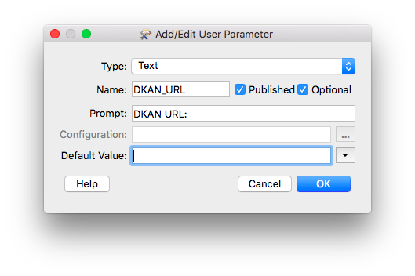
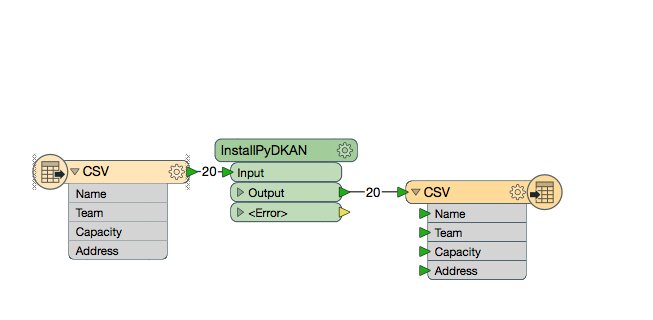
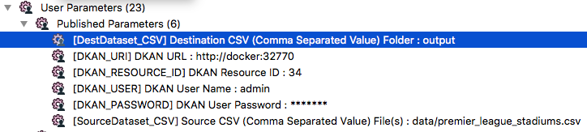
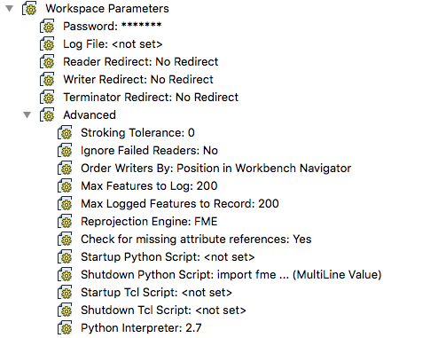
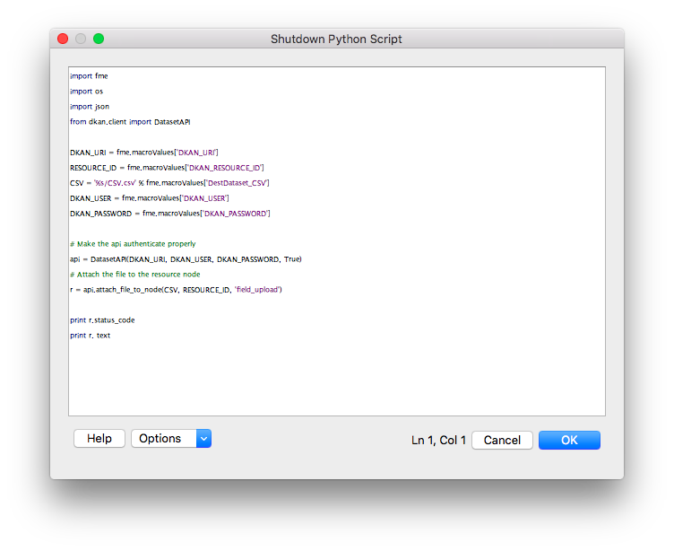

# Using the library to attach a csv to a resource

## Set up User Parameters

You'll need to manually set up parameters for:

+ the URI for the dkan site
+ the node id to attach the file to
+ dkan's site username
+ dkan's site password

Your workflow needs to read data from a source and write that data (or some transformed version of it) to a csv file that will uploaded. Setting this two items will add the remaining paramaters:

+ a source of data
+ the path of the workflow's resulting csv

In order to set the manual parameters up:

+ Using the navigator expand `User Parameters/Published Parameters`
+ Right click and click `Add Parameter`



+ Create parameter to hold the the url of the dkan site



+ Repeat for resource id, username and password

## Add python code to handle the upload

Let's say we have the following workflow:



And the following user parameters:



+ *DKAN_URI* -> the dkan site url
+ *DKAN_RESOURCE_ID* -> the dkan's resource that will receive the file
+ *DKAN_USER* -> the dkan user to authenticate
+ *DKAN_PASSWORD* -> the password for the dkan user
+ *DestDataset_CSV* -> the resulting csv 

In order to add the upload behaviour:

+ Using the navigator expand `Workspace Parameters/Advanced`



+ Double click `Shutdown Python Script`. A code editor will pop



+ Paste the following snippet:

```python
import fme
import os
import json
from dkan.client import DatasetAPI

# Set PYDKAN PARAMETERS from fme's USER PARAMETERS
DKAN_URI = fme.macroValues['DKAN_URI']
RESOURCE_ID = fme.macroValues['DKAN_RESOURCE_ID']
CSV = '%s/CSV.csv' % fme.macroValues['DestDataset_CSV']
DKAN_USER = fme.macroValues['DKAN_USER']
DKAN_PASSWORD = fme.macroValues['DKAN_PASSWORD']

# Make the api authenticate properly
api = DatasetAPI(DKAN_URI, DKAN_USER, DKAN_PASSWORD, True)
# Attach the file to the resource node
r = api.attach_file_to_node(CSV, RESOURCE_ID, 'field_upload')

print r.status_code
print r.text
```

+ Run the workflow and check the results

## Prepacked example

You can find this example workflow all wired up [here](../dkan_dataset_rest_api/attach_file_to_node.fmw). It is ready for command line usage so you can use it with your own parameters:

```bash
$ cd dkan_dataset_rest_api
$ /Library/FME/2016.1/fme attach_file_to_node.fmw \
			--DKAN_URI "http://docker:32770" \
			--DKAN_RESOURCE_ID "34" \
			--DKAN_USER "admin" \
			--DKAN_PASSWORD "admin" \
			--SourceDataset_CSV "data/premier_league_stadiums.csv" \
			--FME_JOB_ID 1
```
